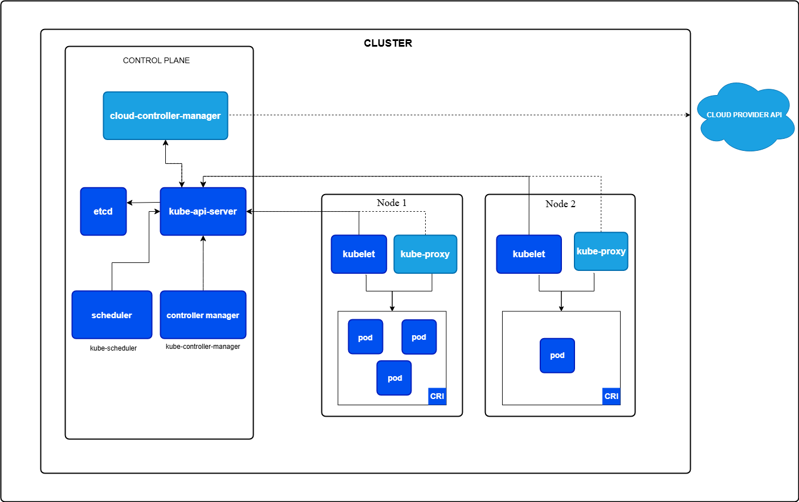

# Week 3 - 장애 대응 이론 정리 (Haejun)

이번 주는 실습 전에 머릿속 지도를 먼저 그리는 시간이다.  
핵심은 단순히 용어를 외우는 게 아니라, 장애가 났을 때 **어디부터 의심해야 하는지**를 몸에 익히는 것.

---

## Part 1. 아키텍처와 장애의 상관관계 (The Map)

위 그림은 Control Plane, Worker Node, 그리고 외부 클라우드 API 연결 지점을 한눈에 보여준다.  
Part 1에서는 이 구조를 기준으로 "어느 컴포넌트가 멈췄을 때 어떤 증상으로 나타나는지"를 따라간다.

### 1.1 컨트롤 플레인(Control Plane)의 유기적 흐름

#### kube-apiserver: 통신 요충지의 마비 (인증, 인가, 타임아웃)
- 모든 요청의 관문이다. `kubectl`이든 컨트롤러든 결국 API Server를 통과한다.
- 여기서 인증/인가가 꼬이거나 타임아웃이 늘어나면, 클러스터 전체가 "느리게 죽는" 느낌으로 보인다.
- 증상:
	- `kubectl get` 자체가 느리거나 간헐적으로 실패
	- 상태 변경 요청이 반영되지 않음
	- 컨트롤러가 재시도를 반복
- 체크 포인트:
	- API Server latency/timeout 지표
	- 인증서 만료, RBAC 변경 이력
	- etcd와의 연결 상태

#### etcd: 데이터 일관성 붕괴와 쿼럼(Quorum) 장애의 공포
- etcd는 "클러스터의 단일 진실 소스"다.
- 리더 선출이 불안정하거나 쿼럼이 깨지면 읽기/쓰기 모두 불안해진다.
- 증상:
	- 리소스 생성/수정이 되다 말다 함
	- 컨트롤 플레인 컴포넌트가 동시에 흔들림
- 체크 포인트:
	- 멤버 수와 쿼럼 성립 여부
	- 디스크 I/O 지연, fsync 지연
	- 리더 변경 빈도(잦은 리더 변경은 위험 신호)

#### kube-scheduler: "갈 곳 없는 Pod" - 스케줄링 로직과 리소스 필터링 이해
- 스케줄러는 "아무 노드에나" 붙이지 않는다. 조건을 하나씩 통과해야 한다.
- 리소스 부족, 노드 셀렉터, Taint/Toleration, Affinity 규칙이 겹치면 Pending이 길어진다.
- 증상:
	- Pod가 오래 `Pending`
	- 이벤트에 `0/NN nodes are available` 메시지 반복
- 체크 포인트:
	- requests/limits 과도 설정 여부
	- nodeSelector, affinity, toleration 충돌
	- 특정 노드 편중(스케줄링 불균형)

#### kube-controller-manager: 상태 유지 실패 (Replication, Endpoint 갱신 불능)
- 컨트롤러는 "원하는 상태(Desired State)"를 현실로 맞춰주는 자동 복구 장치다.
- 여기서 문제가 나면 Replica 유지도, Endpoint 반영도 어긋난다.
- 증상:
	- Deployment가 목표 replica에 도달하지 못함
	- Service가 살아 있는데 트래픽이 일부 Pod로만 감
- 체크 포인트:
	- 컨트롤러 리더 선출 상태
	- 워크큐 지연/재시도 폭증
	- Endpoints/EndpointSlice 갱신 타이밍

### 1.2 데이터 플레인(Worker Node)의 생존 전략

#### kubelet: 노드 이탈(NotReady)과 컨테이너 라이프사이클 관리 실패
- kubelet은 노드의 현장 운영자다. Pod 실행/헬스체크/상태 보고를 맡는다.
- kubelet이 흔들리면 노드는 살아 있어도 제어가 안 된다.
- 증상:
	- Node 상태가 `NotReady`
	- Pod 상태 갱신 지연, 재시작 루프
- 체크 포인트:
	- kubelet 프로세스 상태, 재시작 이력
	- 디스크/메모리/PID 여유
	- CNI/CRI 호출 실패 로그

#### kube-proxy: 서비스 가상 IP와 iptables/IPVS 룰의 미로
- kube-proxy는 Service VIP를 실제 Pod로 연결하는 규칙 엔진이다.
- 규칙이 누락/오염되면 "서비스는 있는데 연결이 안 되는" 상황이 생긴다.
- 증상:
	- 특정 노드에서만 Service 접근 실패
	- 간헐적 타임아웃, 연결 리셋
- 체크 포인트:
	- iptables/IPVS 룰 동기화 상태
	- Endpoint 변경 반영 지연
	- conntrack 포화 여부

#### Container Runtime: 컨테이너 엔진(containerd/CRI-O)의 먹통 현상
- 런타임은 실제 컨테이너를 띄우는 엔진이다.
- 여기서 문제가 나면 스케줄링이 끝난 Pod도 실행 단계에서 멈춘다.
- 증상:
	- `ContainerCreating` 장기화
	- 이미지 풀/컨테이너 시작 실패
- 체크 포인트:
	- 런타임 데몬 헬스 상태
	- 이미지 스토어 용량, inode 고갈
	- cgroup/권한 설정 충돌

### 1.3 요청의 일생(Life of a Request) 추적

#### 생성 요청 흐름: kubectl → etcd → Node 안착까지의 병목 구간
1. 사용자가 `kubectl apply` 요청을 보냄
2. API Server가 인증/인가 후 객체를 etcd에 기록
3. 스케줄러가 배치 노드를 선택
4. kubelet이 Pod를 생성하고 런타임이 컨테이너를 실행
5. 컨트롤러가 상태를 수렴

- 병목이 생기는 대표 구간:
	- API Server 응답 지연
	- etcd write 지연
	- 스케줄링 후보 부족
	- 이미지 pull 지연

#### 트래픽 흐름: Client → Ingress → Service → Pod 연결 고리 분석
- 외부 요청은 보통 Ingress/LB를 거쳐 Service로 들어가고, 최종적으로 Pod에 도달한다.
- 이 경로 중 한 군데라도 어긋나면 502/504 혹은 타임아웃으로 드러난다.
- 빠른 점검 순서:
	1. Ingress/LB 라우팅 규칙
	2. Service selector와 Endpoints
	3. Pod readiness 상태
	4. 앱 내부 포트/헬스체크 경로

---

## Part 2. 필수 디버깅 도구 및 데이터 분석 (The Tools)

### 2.1 kubectl 마스터하기

#### describe, logs, get events를 활용한 1차 진단
- `kubectl describe pod <name>`: 스케줄링/프로브/마운트 실패 이유를 이벤트로 확인
- `kubectl logs <pod> -c <container>`: 애플리케이션 에러와 종료 직전 흔적 확인
- `kubectl get events --sort-by=.lastTimestamp`: 최근에 무슨 일이 있었는지 시간축으로 복원

#### JSONPath 및 필터링을 이용한 대규모 리소스 상태 스캔
- 노드/Pod가 많을수록 눈으로 보는 진단은 한계가 있다.
- JSONPath와 label selector로 "문제 있는 집합"을 빠르게 좁힌다.
- 예시:
	- 특정 상태 Pod만 추출
	- 재시작 횟수 높은 컨테이너 상위 확인
	- 특정 노드에 몰린 워크로드 탐지

#### kubectl debug: 실행 중인 Pod에 사이드카를 붙여 직접 침투하기
- 앱 이미지에 디버깅 도구가 없어도, ephemeral container로 현장 조사 가능.
- 네트워크/DNS/파일시스템 확인에 특히 유용하다.
- 주의:
	- 프로덕션에서는 접근 통제(RBAC)와 감사 로그 필수
	- 조사 후 흔적(임시 도구/설정) 정리 필요

### 2.2 모니터링 시스템 기반 진단

#### Prometheus Metrics: CPU Throttling vs Usage 지표 구별법
- CPU Usage가 낮아도 Throttling이 높으면 응답이 느릴 수 있다.
- 즉, "쓴 CPU"만 보면 놓치고, "막힌 CPU"까지 같이 봐야 한다.
- 같이 볼 지표:
	- CPU usage
	- CFS throttled time/periods
	- request/limit 설정

#### Grafana Dashboard: 노드/Pod 레벨의 이상 징후 포착 (Saturation 지표)
- 장애 전조는 보통 Saturation에서 먼저 나타난다.
- CPU, 메모리뿐 아니라 디스크 I/O, 네트워크 큐, 파일 디스크립터까지 본다.
- 관찰 팁:
	- "평소 baseline"을 알아야 이상치를 구분할 수 있음
	- 단일 시점보다 구간 추세로 판단

#### 로그 분석 플랫폼(Loki/ELK)을 통한 분산 트레이싱 기초
- 로그는 사건의 문맥, 메트릭은 사건의 크기다. 둘을 함께 봐야 원인이 선명해진다.
- 요청 ID/트레이스 ID를 기준으로 서비스 간 흐름을 묶어 본다.
- 실무 포인트:
	- 공통 필드(서비스명, 요청 ID, 에러코드) 표준화
	- 샘플링 정책과 보존 기간을 장애 대응 관점에서 설계

---

## Part 3. 상황별 장애 대응 매뉴얼: 컴퓨트 & 워크로드 (The Soul)

### 3.1 Pod 상태별 심층 디버깅

#### Pending: 리소스 부족, 노드 셀렉터, Taints/Tolerations 충돌
- 가장 먼저 이벤트를 본다. 스케줄링 실패 원인은 이벤트에 거의 다 나온다.
- 자주 놓치는 포인트:
	- requests 과다 설정으로 후보 노드 없음
	- nodeSelector와 실제 노드 라벨 불일치
	- toleration 누락으로 tainted node 배치 불가

#### CrashLoopBackOff: Exit Code(1, 137, 139 등)에 따른 앱 내부 결함 진단
- `ExitCode=1`: 일반 앱 예외/설정 오류 가능성 큼
- `ExitCode=137`: OOMKill 또는 강제 종료 시그널 의심
- `ExitCode=139`: 세그멘테이션 폴트(네이티브 라이브러리, 메모리 접근 문제) 가능성
- 대응 순서:
	1. 이전 컨테이너 로그(`--previous`) 확인
	2. 최근 배포 변경점(이미지/환경변수/시크릿) 확인
	3. 리소스 제한과 프로브 설정 재검토

#### ImagePullBackOff: 레지스트리 인증, 네트워크 차단, 태그 오타
- 이 상태는 생각보다 단순 실수 비율이 높다.
- 대표 원인:
	- 이미지 태그 오타
	- imagePullSecret 누락/만료
	- 노드에서 레지스트리 네트워크 차단
- 확인 포인트:
	- Pod 이벤트의 실제 pull 에러 문구
	- 노드 레벨 DNS/방화벽 정책

### 3.2 Pod 종료 및 교체 장애

#### Terminating 지연: Finalizers 문제 및 좀비 프로세스 해결
- 삭제 요청이 갔는데 끝나지 않으면 Finalizer 또는 종료 훅을 의심한다.
- 점검 포인트:
	- Finalizer가 제거되지 않는 이유
	- `preStop` 훅 장기 실행
	- PID 1 프로세스 종료 처리 미흡으로 좀비 누적

#### Rolling Update 정체: 배포 전략 설정 오류 및 건강 상태 체크(Probes) 실패
- 업데이트가 멈추는 건 대부분 "새 Pod가 Ready가 안 됨"이다.
- 흔한 원인:
	- readinessProbe 경로/포트 불일치
	- `maxUnavailable`, `maxSurge` 설정 부조화
	- startup 지연이 큰데 probe timeout이 너무 짧음

### 3.3 리소스 제한과 성능 저하

#### CPU Throttling에 의한 응답 지연 현상 분석
- CPU 사용량이 100%가 아니어도 지연이 생길 수 있다.
- 제한(limit)이 낮으면 CFS throttling으로 짧은 정지 구간이 반복된다.
- 대응:
	- limit 상향 또는 request/limit 재설계
	- 지연 민감 워크로드는 HPA 기준에 throttling 지표 반영 고려

#### Memory Limit 초과에 의한 OOMKilled 연쇄 발생 대응
- 한 번 OOM이 나면 재기동 후 캐시 워밍 중 다시 OOM이 나는 연쇄가 생길 수 있다.
- 대응:
	- 메모리 프로파일링으로 피크 구간 확인
	- limit 상향 전, 누수 여부와 GC 튜닝 병행
	- QoS 클래스와 노드 메모리 압박 이벤트 함께 확인

---

## Part 4. 상황별 장애 대응 매뉴얼: 네트워크 (The Nerve)

### 4.1 클러스터 내부 통신 장애

#### Service-Pod 매핑 실패: Label/Selector 불일치 집중 점검
- Service가 살아 있어도 selector가 틀리면 Endpoints가 비어 있다.
- 가장 먼저 볼 것:
	- Service selector
	- Pod label
	- Endpoint/EndpointSlice 생성 여부

#### CoreDNS 장애: DNS 쿼리 지연 및 ndots 최적화 전략
- DNS 지연은 체감상 "앱이 느리다"로 나타나서 초반에 놓치기 쉽다.
- 점검 포인트:
	- CoreDNS Pod 상태와 에러 로그
	- upstream DNS 응답 지연
	- `ndots` 값으로 인한 불필요한 질의 폭증

### 4.2 외부 유입 및 CNI 장애

#### Ingress/LoadBalancer: 502/504 에러와 SSL 인증서 만료 대응
- 502는 보통 upstream 연결 실패, 504는 upstream 응답 지연/타임아웃에 가깝다.
- SSL 인증서 이슈는 만료/체인 누락/도메인 불일치로 자주 발생한다.
- 점검 순서:
	1. Ingress Controller 로그
	2. 백엔드 Service/Pod readiness
	3. 인증서 만료일 및 시크릿 갱신 상태

#### CNI 플러그인 장애: IP 할당 고갈 및 노드 간 VXLAN 터널링 단절
- CNI가 흔들리면 Pod는 떠도 통신이 안 된다.
- 대표 증상:
	- 신규 Pod IP 할당 실패
	- 노드 간 통신 단절(특히 overlay 네트워크)
- 점검 포인트:
	- CNI IPAM 풀 사용량
	- 터널 인터페이스 상태
	- MTU 불일치

#### kube-proxy 룰 오염: iptables 찌꺼기로 인한 간헐적 통신 실패
- 롤링 재시작/노드 장애 이후 룰이 비정상 누적되는 경우가 있다.
- 증상은 "간헐적"이라 재현이 어려운 편.
- 대응:
	- 룰 동기화 상태 재점검
	- 필요 시 노드 단위로 정리 후 kube-proxy 재동기화
	- conntrack 테이블 상태와 함께 확인

---

## Part 5. 상황별 장애 대응 매뉴얼: 스토리지 (The Memory)

### 5.1 볼륨 바인딩 및 마운트 실패

#### PVC Pending: StorageClass 설정 및 클라우드 프로비저닝 오류
- PVC가 Pending이면 "요청은 했지만 실제 볼륨을 못 받았다"는 뜻.
- 주요 원인:
	- 기본 StorageClass 부재/오타
	- 프로비저너 권한 문제
	- 영역(Zone) 제약으로 바인딩 실패

#### FailedMount: 접근 권한(Permission) 및 경로 불일치
- 볼륨은 붙었는데 마운트 실패하는 케이스.
- 자주 보는 원인:
	- 파일 시스템 권한/보안 컨텍스트 불일치
	- 마운트 경로 오타
	- 읽기 전용 볼륨에 쓰기 시도

### 5.2 볼륨 독점 및 성능 병목

#### Multi-Attach Error: 노드 간 볼륨 이동 시 발생하는 데드락 해소
- `ReadWriteOnce` 볼륨을 동시에 여러 노드에서 붙이려 할 때 충돌한다.
- 대응:
	- 기존 노드에서 detach 완료 여부 확인
	- 강제 삭제보다 "정상 detach 대기"가 더 안전한 경우가 많음
	- 워크로드 배치 전략(anti-affinity, topology) 재설계

#### IOPS Limit: 클라우드 스토리지 성능 제한에 따른 앱 지연
- 앱이 느린데 CPU는 여유라면 스토리지 I/O를 의심한다.
- 점검 포인트:
	- 디스크 IOPS/throughput 한도
	- 큐 길이와 평균 대기 시간
	- 배치 작업 시간대와 트래픽 피크 중첩 여부

---

## Part 6. 노드 레벨 및 인프라 장애 (The Foundation)

### 6.1 Node NotReady의 모든 것

#### Kubelet 프로세스 중단 및 시스템 리소스(PID, Disk) 고갈
- kubelet이 죽거나 시스템 자원이 바닥나면 노드는 빠르게 불안정해진다.
- 체크 포인트:
	- kubelet 프로세스 상태
	- 디스크 사용률/ inode / PID 여유
	- node pressure condition(`MemoryPressure`, `DiskPressure`, `PIDPressure`)

#### 네트워크 파티션으로 인한 마스터-워커 간 통신 두절
- 노드 자체는 살아 있는데 컨트롤 플레인과 단절되면 NotReady로 보인다.
- 대응:
	- API Server까지의 경로/방화벽/라우팅 점검
	- 일시 단절인지 지속 단절인지 구분
	- 복구 후 노드 상태/워크로드 재균형 확인

### 6.2 커널 및 하드웨어 장애

#### Kernel Panic, Conntrack Table Full, 좀비 프로세스 누적
- 이 레벨 장애는 "쿠버네티스 이전" 문제라 증상이 크게 보인다.
- 예시:
	- Kernel panic으로 노드 재부팅 반복
	- conntrack table 포화로 신규 연결 실패
	- 좀비 프로세스 누적으로 PID 고갈
- 대응:
	- 커널 로그와 시스템 한도(sysctl) 함께 분석
	- 단기 우회보다 원인 제거(테이블 크기, 누수 프로세스) 우선

#### GPU/특수 장치 드라이버 인식 불가 대응
- AI/미디어 워크로드에서 자주 만나는 문제.
- 점검 포인트:
	- 드라이버 버전-커널 호환성
	- 디바이스 플러그인 상태
	- 노드 레이블/리소스 advertise 여부
