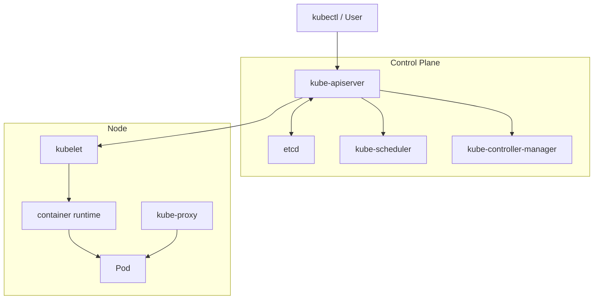
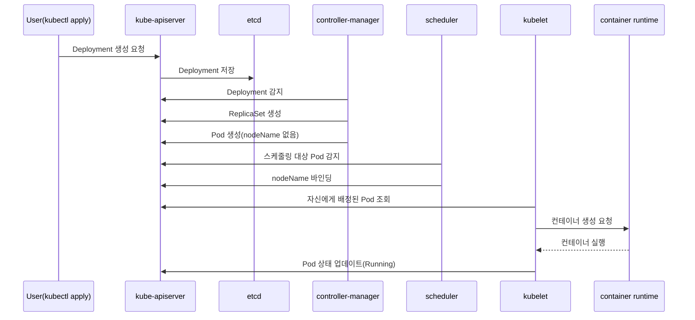
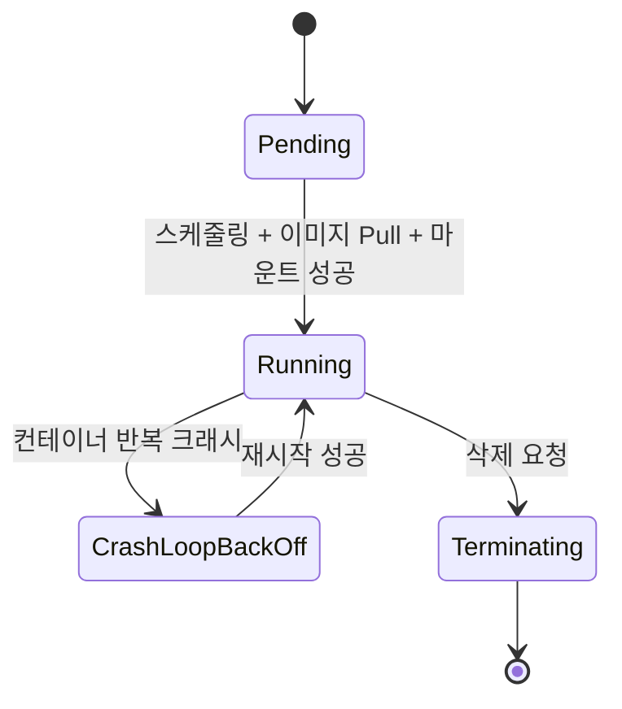
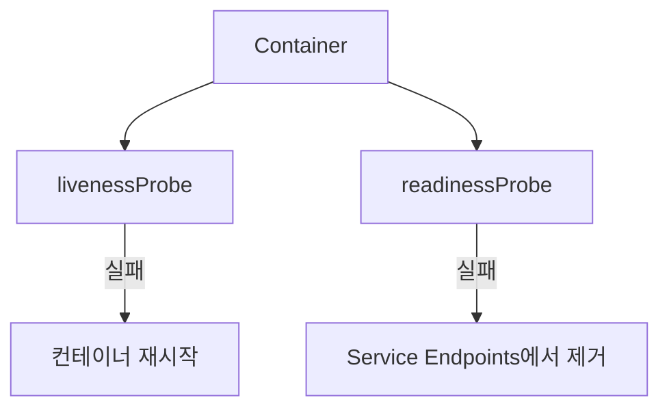

# 📚 이론 학습

## 1️⃣ Kubernetes 전체 아키텍처

Kubernetes는 크게 **Control Plane**과 **Node**로 구성된다.



### 1-1. Control Plane 구성요소

#### kube-apiserver

* 모든 요청의 진입점이다.
* `kubectl`, `kubelet`, `controller`, `scheduler` 등 모든 컴포넌트는 `apiserver`를 통해 통신한다.
* 인증(Authentication), 인가(Authorization), Admission Control을 거친 뒤 상태를 저장하거나 조회한다.
* 최종적으로 클러스터 상태는 `etcd`에 기록된다.

#### etcd

* 클러스터의 모든 상태를 저장하는 분산 Key-Value 저장소다.
* Kubernetes의 **Single Source of Truth** 역할을 한다.
* Pod, Node, ConfigMap, Secret, Service 등 모든 오브젝트의 상태 정보가 저장된다.

#### kube-scheduler

* 새로 생성된 Pod 중 아직 노드가 배정되지 않은 Pod를 감지한다.
* 리소스 사용량, affinity/anti-affinity, taint/toleration 등의 조건을 평가해 적절한 노드를 선택한다.
* 선택된 노드 정보를 Pod에 바인딩한다.

#### kube-controller-manager

* Desired State와 Current State의 차이를 지속적으로 감지하고 조정하는 컨트롤러들의 집합이다.
* 대표적으로 다음과 같은 컨트롤러가 동작한다.

  * ReplicaSet Controller
  * Deployment Controller
  * Node Controller
  * Endpoint Controller

### 1-2. Node 구성요소

#### kubelet

* 각 노드에서 실행되는 에이전트다.
* `apiserver`로부터 PodSpec을 받아 실제 컨테이너 실행을 준비한다.
* 컨테이너 런타임에 컨테이너 생성/실행을 요청한다.
* `livenessProbe`, `readinessProbe` 등의 Probe도 수행한다.

#### container runtime

* 실제 컨테이너를 실행하는 엔진이다.
* 대표적으로 `containerd`, `CRI-O` 등이 있다.
* `kubelet`은 CRI(Container Runtime Interface)를 통해 런타임과 통신한다.

#### kube-proxy

* 각 노드에서 Service 네트워크 규칙을 관리한다.
* `iptables` 또는 `IPVS` 규칙을 설정하여 Service IP로 들어온 트래픽을 실제 Pod IP로 전달한다.

### 1-3. Pod 생성 요청 시 내부 동작 흐름

사용자가 `kubectl apply`로 Deployment를 생성했을 때의 흐름은 다음과 같다.



## 2️⃣ Pod Lifecycle & 상태

Pod는 생성부터 종료까지 여러 상태를 거친다.

### 2-1. Pod 상태 흐름



#### Pending

* Pod 오브젝트는 생성되었지만 아직 컨테이너가 실행되지 않은 상태다.
* 대표 원인:

  * 노드 배정 대기
  * 이미지 Pull 대기
  * 볼륨 마운트 대기
  * 리소스 부족

#### Running

* 최소 하나의 컨테이너가 실행 중인 상태다.
* 단, **모든 컨테이너가 정상**이라는 의미는 아니다.

#### CrashLoopBackOff

* 컨테이너가 실행 직후 반복적으로 크래시하는 상태다.
* `kubelet`은 재시작을 시도하지만, 재시작 간격은 점점 늘어난다.

  * 예: 10초 → 20초 → 40초 ... 최대 약 5분

#### Terminating

* 삭제 요청을 받고 종료 절차를 수행 중인 상태다.
* 기본적으로 `terminationGracePeriodSeconds` 동안 `SIGTERM`을 보내 graceful shutdown을 시도한다.
* 시간이 초과되면 `SIGKILL`로 강제 종료된다.

### 2-2. Probe



#### livenessProbe

* 컨테이너가 살아 있는지 확인한다.
* 실패하면 `kubelet`이 해당 컨테이너를 **재시작**한다.
* 데드락이나 내부 무한 대기 상태를 감지하는 데 유용하다.

#### readinessProbe

* 컨테이너가 트래픽을 받을 준비가 되었는지 확인한다.
* 실패하면 해당 Pod는 Service의 Endpoints에서 **제외**된다.
* 컨테이너 자체를 재시작하지는 않는다.

### 2-3. 핵심 장애 패턴

#### CrashLoopBackOff가 발생하는 주요 원인

* 애플리케이션 코드 에러
* 환경변수, ConfigMap, Secret 누락
* 잘못된 command / entrypoint 설정
* 리소스 부족으로 인한 `OOMKilled`
* 의존 서비스(DB, Redis, 외부 API) 연결 실패

#### “서비스는 정상인데 트래픽이 안 붙는” 경우

이 상황은 Kubernetes에서 매우 자주 보이는 전형적인 장애 패턴이다.

* Pod 상태는 `Running`이다.
* 하지만 `readinessProbe`가 실패하고 있다.
* 따라서 해당 Pod는 Service Endpoints에서 제외된다.
* 결과적으로 Pod는 살아 있지만 실제 트래픽은 전달되지 않는다.

즉,

* `kubectl get pod`로 보면 정상처럼 보일 수 있다.
* 하지만 `kubectl get endpoints`를 보면 Pod IP가 빠져 있다.

### 2-4. 대응 순서

1. `kubectl describe pod <pod-name>`

   * Events 섹션에서 스케줄링 실패, 이미지 Pull 실패, Probe 실패 등을 확인한다.

2. `kubectl logs <pod-name>`

   * 현재 컨테이너 로그를 확인한다.

3. `kubectl logs <pod-name> --previous`

   * 이전 크래시 컨테이너 로그를 확인한다.

4. `kubectl get events --sort-by='.lastTimestamp'`

   * 전체 이벤트 흐름을 시간순으로 확인한다.

## 3️⃣ Kubernetes Networking

Kubernetes 네트워크 장애는 보통 다음 중 하나로 귀결된다.

* Service가 잘못 연결됨
* Endpoints가 비어 있음
* kube-proxy 규칙 문제
* CNI 네트워크 문제

### 3-1. Service 종류

#### ClusterIP

* 클러스터 내부에서만 접근 가능한 가상 IP를 제공한다.
* 기본 Service 타입이다.
* 외부에서는 직접 접근할 수 없다.

#### NodePort

* 모든 노드의 특정 포트를 열어 외부 요청을 받을 수 있게 한다.
* 일반적으로 `30000-32767` 범위를 사용한다.
* 외부 요청은 `NodeIP:NodePort` 형태로 접근한다.

#### LoadBalancer

* 클라우드 환경에서 외부 로드밸런서를 자동으로 생성한다.
* 외부 IP를 할당받아 외부 트래픽을 클러스터 내부 Service로 연결한다.
* 내부적으로는 일반적으로 `LoadBalancer -> NodePort -> ClusterIP` 구조를 따른다.

### 3-2. kube-proxy의 역할

`kube-proxy`는 각 노드에서 Service의 가상 IP에 대한 라우팅 규칙을 관리한다.

* Service와 Endpoints 정보를 기반으로
* `iptables` 또는 `IPVS` 규칙을 생성하고
* ClusterIP로 들어온 요청을 실제 Pod IP로 전달한다.

즉, Service는 논리적 추상화이고,
실제 패킷 전달은 노드의 네트워크 규칙이 담당한다.

### 3-3. Pod → Service → Pod 트래픽 흐름

1. Pod A가 Service의 `ClusterIP:Port`로 요청을 보낸다.
2. 해당 노드의 `iptables` 규칙이 Service IP를 실제 백엔드 Pod IP 중 하나로 DNAT한다.
3. 패킷이 선택된 Pod B의 `IP:Port`로 전달된다.
4. 응답은 커넥션 트래킹을 통해 원래 요청 경로로 되돌아간다.

### 3-4. 핵심 장애 패턴

#### 특정 노드에서만 통신이 안 되는 경우

대표적인 원인은 다음과 같다.

* 해당 노드의 `kube-proxy`가 비정상 상태다.
* `iptables` 규칙 갱신이 누락되었다.
* CNI 플러그인 문제로 Pod 간 네트워크가 끊겼다.
* 노드의 네트워크 규칙이 과도하게 누적되거나 충돌했다.

### 3-5. 대응 순서

1. `kubectl get svc`

   * Service의 ClusterIP와 포트 정보를 확인한다.

2. `kubectl get endpoints`

   * Service에 연결된 Pod IP 목록을 확인한다.
   * 비어 있다면 selector 불일치 또는 readinessProbe 실패 가능성이 높다.

3. 문제 노드에서 `iptables -t nat -L -n`

   * `KUBE-SERVICES` 체인을 확인한다.

4. `kube-proxy` 로그 확인

   * `kubectl logs -n kube-system <kube-proxy-pod>`

5. 노드 간 Pod IP 통신 테스트

   * `ping`, `curl`, `nc` 등으로 네트워크 연결을 확인한다.

## 4️⃣ Kubernetes Storage

스토리지 장애는 Pod가 떠오르지 않는 원인 중 하나이며,
특히 `Pending`, `ContainerCreating`, `FailedMount`와 강하게 연결된다.

### 4-1. 핵심 개념

#### PV (PersistentVolume)

* 클러스터 레벨의 스토리지 리소스다.
* 관리자가 미리 생성하거나 StorageClass를 통해 동적으로 생성된다.

#### PVC (PersistentVolumeClaim)

* Pod가 스토리지를 요청하는 방식이다.
* 용량, 접근 모드, StorageClass 등을 명시한다.
* 조건에 맞는 PV와 바인딩된다.

#### StorageClass

* 동적 프로비저닝을 위한 템플릿이다.
* 어떤 프로비저너를 사용할지, 어떤 파라미터로 볼륨을 만들지 정의한다.
* 예: AWS EBS, GCE PD 등

### 4-2. Volume Attach 흐름

1. PVC를 생성한다.
2. StorageClass가 지정되어 있으면 프로비저너가 실제 볼륨(PV)을 생성한다.
3. PV와 PVC가 바인딩된다.
4. Pod가 해당 PVC를 참조하면 `kubelet`이 볼륨 Attach / Mount를 수행한다.
5. 컨테이너는 마운트된 경로를 통해 데이터를 읽고 쓴다.

### 4-3. 핵심 장애 패턴

#### PVC가 Pending 상태에 머무는 주요 원인

* 조건에 맞는 PV가 없다.
* StorageClass가 지정되지 않았다.
* 프로비저너가 비정상 상태다.
* 요청한 용량이 너무 크다.
* `accessModes`가 일치하지 않는다.
* PV와 Pod가 서로 다른 Zone/AZ 제약에 묶여 있다.

#### 스토리지 문제와 Pod 생성 실패의 관계

* PVC가 `Pending`이면 Pod도 `Pending`에 머무를 수 있다.
* Attach / Mount 실패 시 Pod는 `ContainerCreating`에서 멈출 수 있다.

### 4-4. 대응 순서

1. `kubectl get pvc`

   * PVC 상태가 `Pending`인지 `Bound`인지 확인한다.

2. `kubectl describe pvc <pvc-name>`

   * 이벤트를 통해 프로비저닝 실패 원인을 확인한다.

3. `kubectl get pv`

   * 사용 가능한 PV 목록과 조건을 확인한다.

4. `kubectl get storageclass`

   * StorageClass와 프로비저너 설정을 확인한다.

5. `kubectl describe pod <pod-name>`

   * `FailedAttachVolume`, `FailedMount` 등의 이벤트를 확인한다.

## 5️⃣ Workload 리소스

### 5-1. Deployment와 ReplicaSet

#### Deployment

* 애플리케이션의 Desired State를 선언적으로 정의한다.
* replicas, 이미지 버전, 업데이트 전략 등을 관리한다.

#### ReplicaSet

* Deployment가 내부적으로 생성하는 리소스다.
* 실제 Pod 개수를 Desired 개수와 맞추는 역할을 수행한다.

#### 관계

* `Deployment -> ReplicaSet -> Pod`


### 5-2. Desired State 개념

Kubernetes의 핵심 철학은 **선언적 상태 관리(Declarative State Management)** 다.

* 사용자는 “이 상태가 되어야 한다”를 선언한다.
* 컨트롤러는 현재 상태와 비교한다.
* 차이가 있으면 자동으로 조정한다.

즉, 장애 대응에서는 현재 눈앞의 Pod만 보는 것이 아니라,
**그 Pod를 다시 만들고 있는 상위 리소스가 무엇인지**까지 확인해야 한다.


### 5-3. Rolling Update 동작 방식

1. Deployment의 이미지 버전을 변경한다.
2. Deployment Controller가 새로운 ReplicaSet을 생성한다.
3. `maxSurge` 설정에 따라 새 ReplicaSet의 Pod 수를 점진적으로 늘린다.
4. 새 Pod가 Ready 상태가 되면 `maxUnavailable` 설정에 따라 이전 Pod 수를 줄인다.
5. 이 과정을 반복해 전체 Pod를 새 버전으로 교체한다.
6. 이전 ReplicaSet은 일반적으로 `replicas=0` 상태로 남아 롤백에 활용된다.


### 5-4. 핵심 장애 패턴

#### Pod가 계속 재생성되는 이유

* ReplicaSet Controller가 Desired 수를 맞추기 때문이다.
* 크래시한 Pod가 사라지면 즉시 새 Pod를 만든다.

#### 수동으로 삭제한 Pod가 다시 생성되는 이유

* Deployment / ReplicaSet이 여전히 해당 Pod 수를 원하고 있기 때문이다.
* Pod만 삭제해서는 상위 리소스의 Desired State가 바뀌지 않는다.

즉, Pod를 영구적으로 줄이려면 다음 중 하나가 필요하다.

* Deployment를 삭제한다.
* `replicas` 값을 줄인다.


### 5-5. 대응 포인트

* `kubectl get rs`

  * 현재 활성 ReplicaSet과 이전 ReplicaSet을 확인한다.

* `kubectl rollout status deployment/<name>`

  * 롤링 업데이트 진행 상태를 확인한다.

* `kubectl rollout undo deployment/<name>`

  * 이전 버전으로 롤백한다.


## 6️⃣ 기본 디버깅 방법

Kubernetes에서는 다음 세 가지 명령이 가장 기본적이다.

### 6-1. 핵심 도구 3가지

#### `kubectl logs`

컨테이너의 stdout/stderr를 확인한다.

* `kubectl logs <pod>`
* `kubectl logs <pod> --previous`
* `kubectl logs <pod> -c <container>`

주로 애플리케이션 레벨 에러를 확인하는 1차 도구다.

#### `kubectl describe`

리소스의 상세 정보와 Events를 확인한다.

* 스케줄링 실패
* 이미지 Pull 실패
* Probe 실패
* 볼륨 마운트 실패

같은 운영 이슈를 빠르게 확인할 수 있다.

#### `kubectl get events --sort-by='.lastTimestamp'`

네임스페이스 전체의 이벤트를 시간순으로 확인한다.

* 여러 리소스에 걸친 장애의 전파 경로
* 전체 타임라인
* 최근 변경 직후 발생한 문제

를 파악하는 데 유용하다.

### 6-2. kubectl이 정상 동작하지 않을 때

`kubectl` 자체가 응답하지 않는다면, 이는 보통 `apiserver` 또는 그 이전 계층의 문제다.
이 경우에는 노드에 직접 접근해서 확인해야 한다.

#### kubelet 로그

```bash
systemctl status kubelet
journalctl -u kubelet -f
```

#### container runtime 로그

```bash
journalctl -u containerd -f
```

또는 CRI-O 사용 시 해당 서비스 로그를 확인한다.

#### 시스템 로그

```bash
journalctl -xe
```

커널 레벨의 OOM, 디스크 문제, 네트워크 문제 등을 함께 볼 수 있다.


### 6-3. 디버깅 흐름 정리

장애 발생 시 기본 순서는 다음과 같다.

1. `kubectl get pods`

   * Pod가 어떤 상태에 있는지 확인한다.

2. `kubectl describe pod <pod-name>`

   * 어느 단계에서 실패했는지 확인한다.

3. `kubectl logs <pod-name>`

   * 애플리케이션이 왜 실패했는지 확인한다.

4. `kubectl get events --sort-by='.lastTimestamp'`

   * 클러스터 전체 타임라인을 확인한다.

5. 위 명령이 동작하지 않으면 노드에 직접 접속한다.

   * kubelet 로그
   * container runtime 로그
   * system 로그 확인

6. 노드 리소스를 확인한다.

```bash
df -h
free -m
top
```

# 🧠 과제 (발표 준비)

각자 맡은 주제에 대해 아래 내용을 포함하여 정리 및 발표합니다.

## ✔ 1. 정상 흐름 설명

- 해당 영역에서의 정상 동작 흐름을 설명
- (예: Pod 생성 → 스케줄링 → 실행 → 서비스 연결)


## ✔ 2. 장애 상황 정의

- 해당 영역에서 발생할 수 있는 장애 상황 1가지 정의

예시:
- API Server 장애
- kubelet 장애
- PVC Pending 상태
- Service 라우팅 실패


## ✔ 3. 장애 대응 방법

- 문제 발생 시 확인해야 할 순서 정리

예시:
- 어떤 리소스를 먼저 확인할 것인가
- 어떤 로그를 확인할 것인가
- 어떤 컴포넌트를 의심할 것인가

좋습니다.
그렇다면 각 영역별로 여러 개를 다 쓰지 않고, **가장 일반적으로 많이 만나는 장애 상황 1개만** 잡아서 정리하는 것이 좋습니다.

Kubernetes 입문 및 장애 대응 관점에서 가장 보편적인 예시는 보통 이것입니다:

# Pod는 Running인데 서비스 트래픽이 붙지 않는 상황

즉, **readinessProbe 실패로 Endpoints에서 제외된 경우**

이 사례가 좋은 이유는 다음과 같습니다.

* 현업과 실습에서 자주 나온다
* `Pod 상태`, `Probe`, `Service`, `Endpoints`를 한 번에 연결해서 설명할 수 있다
* “겉보기엔 정상인데 실제론 장애”라는 Kubernetes 특성을 잘 보여준다

아래처럼 정리하면 됩니다.

# 장애 주제

**Pod는 Running인데 서비스 트래픽이 붙지 않는 상황**
주요 원인: **readinessProbe 실패**

## ✔ 1. 정상 흐름 설명

Kubernetes에서 애플리케이션이 정상적으로 서비스되기까지의 흐름은 다음과 같다.

1. 사용자가 Deployment를 생성한다.
2. Pod가 생성되고 스케줄링된다.
3. kubelet이 컨테이너를 실행한다.
4. 컨테이너가 실행되면 Pod 상태는 `Running`이 된다.
5. `readinessProbe`가 성공하면, 해당 Pod는 Service의 Endpoints에 등록된다.
6. 이후 Service로 들어온 트래픽이 해당 Pod로 전달된다.

즉, 정상 흐름은 다음과 같다.

**Pod 생성 → 컨테이너 실행 → readinessProbe 성공 → Endpoints 등록 → Service 트래픽 연결**

## ✔ 2. 장애 상황 정의

이번에 다룰 대표 장애 상황은 다음과 같다.

### readinessProbe 실패

컨테이너는 실행 중이어서 Pod 상태는 `Running`으로 보이지만,
`readinessProbe`가 실패하면 해당 Pod는 Service의 Endpoints에 등록되지 않는다.

그 결과:

* `kubectl get pods`로 보면 정상처럼 보인다
* 하지만 실제 요청은 해당 Pod로 전달되지 않는다
* 사용자는 “서비스가 안 된다”고 느낀다

이 문제는 Kubernetes에서 매우 흔하게 보이는 장애 패턴이다.

## ✔ 3. 장애 대응 방법

문제 발생 시 확인 순서는 다음과 같다.

### 1) Pod 상태 확인

```bash
kubectl get pods
```

Pod가 `Running`인지 먼저 본다.
이 단계에서는 정상처럼 보일 수 있다.

### 2) Pod 상세 정보 확인

```bash
kubectl describe pod readiness-demo
```

여기서 `Events`를 보면 readinessProbe 실패 메시지를 확인할 수 있다.

### 3) Service의 Endpoints 확인

```bash
kubectl get endpoints readiness-svc
```

Endpoints가 비어 있으면, Service가 실제로 트래픽을 전달할 대상 Pod를 갖고 있지 않다는 뜻이다.

### 4) 애플리케이션 로그 확인

```bash
kubectl logs readiness-demo
```

애플리케이션이 `/health` 경로를 제대로 제공하고 있는지, 초기화가 늦는지 등을 확인한다.

### 5) Probe 설정값 점검

다음 항목을 확인한다.

* `path`가 맞는가
* `port`가 맞는가
* 애플리케이션이 해당 경로를 실제로 열고 있는가
* `initialDelaySeconds`가 너무 짧지 않은가

## 코드 예시

아래 예시는 `nginx` 컨테이너에 `/health` 경로가 없는데도 readinessProbe가 `/health`를 검사하도록 설정한 경우다.

따라서 Pod는 실행되지만 Probe는 실패한다.

```yaml
apiVersion: v1
kind: Pod
metadata:
  name: readiness-demo
  labels:
    app: readiness-demo
spec:
  containers:
    - name: nginx
      image: nginx:1.27
      ports:
        - containerPort: 80
      readinessProbe:
        httpGet:
          path: /health
          port: 80
        initialDelaySeconds: 3
        periodSeconds: 5
---
apiVersion: v1
kind: Service
metadata:
  name: readiness-svc
spec:
  selector:
    app: readiness-demo
  ports:
    - port: 80
      targetPort: 80
```

## 확인 명령어

```bash
kubectl apply -f readiness-demo.yaml
kubectl get pods
kubectl describe pod readiness-demo
kubectl get endpoints readiness-svc
kubectl logs readiness-demo
```

## 예시 로그

### `kubectl get pods`

```text
NAME             READY   STATUS    RESTARTS   AGE
readiness-demo   0/1     Running   0          34s
```

핵심은 **STATUS는 Running인데 READY는 0/1** 이라는 점이다.

### `kubectl describe pod readiness-demo`

```text
Events:
  Type     Reason     Age                From               Message
  ----     ------     ----               ----               -------
  Warning  Unhealthy  12s (x4 over 27s)  kubelet            Readiness probe failed: HTTP probe failed with statuscode: 404
```

### `kubectl get endpoints readiness-svc`

```text
NAME            ENDPOINTS   AGE
readiness-svc   <none>      40s
```

